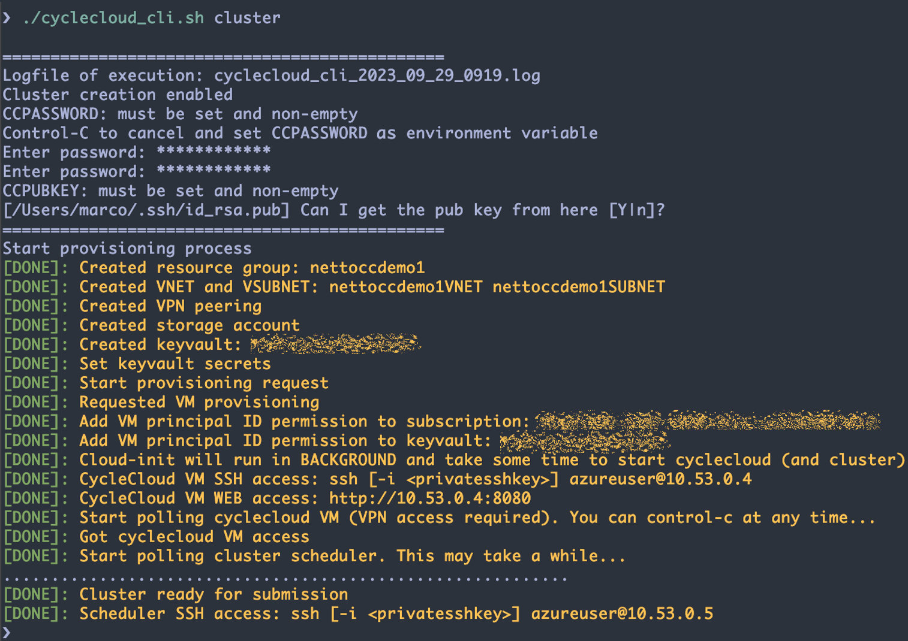

## Automated deployment of CycleCloud and SLURM using CLI

Git Pages: <https://marconetto.github.io/azadventures/chapter11/>


#### TL;TR
- We provide a script for full creation of a CycleCloud instance with a SLURM cluster ready to submit your (MPI) jobs using only Command Line Interface (CLI);
- The script can be used to either provision only CycleCloud instance or go one step further and make a SLURM cluster available---single scheduler node in which compute nodes are added automatically as user submits jobs;
- The proposed solution relies heavily on both cloud-init and Azure/CycleCloud CLI commands;
- Keyvault is used to handle CycleCloud admin password and public ssh key;
- [Git folder](https://github.com/marconetto/azadventures/tree/main/chapter11): git repository with the automation script


<br>

Azure CycleCloud allows the creation of resources to run High Performance
Computing (HPC) applications based on widely used job schedulers such as PBS,
SLURM, and LSF. Once CycleCloud is installed, it requires a few steps in the
browser including setup of site name, accept the license agreement, setup the
administrator account, and add subscription access permissions of the VM
principal ID. After that, if one wants to create a SLURM cluster using existing
built-in template, another set of steps is required; via either browser or
command line.

What if a **single script** could handle all these steps in a **single
execution**? Here we describe the key steps to achieve this automation and the
script itself, which can be used as is---for quick provisioning of CycleCloud
service---or serve as a building block to create more sophisticated
clusters/automation. The scripts relies only on Command Line Interface (CLI).

Here is the git repository that contains the script:
- [git folder](https://github.com/marconetto/azadventures/tree/main/chapter11): git repository with automation script
- [cyclecloud_cli.sh](cyclecloud_cli.sh): automates cyclecloud installation using Azure CLI
- [setvars.sh](setvars.sh): sets variables to customize deployment


Example of execution from a user laptop:

<p align="center" width="100%">
   
</p>


#### Assumptions

- Deployment relies only on PRIVATE IPs, so ideally VPN (or bastion) has to be previously setup;
- Private and public ssh keys available;
- Deployment relies on the built-in SLURM template that comes with CycleCloud, and specification of more sophisticated configuration for the scheduler and compute nodes via CycleCloud projects is out of the scope here;
- All resources (cyclecloud, storage account, keyvault...) are in the same resource group;
- Alma Linux image 8 (`almalinux8` / `almalinux:almalinux-hpc:8_5-hpc-gen2:latest`) is used for both scheduler and compute nodes;
- Azure CLI must be setup in the user machine that triggers the script call (i.e. `az login` should work with the subscription for deployment).


#### 1. How to run the script

Before running the script itself we need to setup a few environment variables; really a few ;-).

Modify `setvars.sh` to customize deployment variables, which are related to
names of resource group, storage account, keyvault, among others. Type the
following command to setup the variables before deployment.

```
source setvars.sh
```

In the automation process we also need two variables: `CCPASSWORD` and
`CCPUBKEY`, which are not in `setvars.sh`. They will be automatically stored
in keyvault and collected by cloud-init when provisioning the cyclecloud VM.

During the execution of the automation script, you will be asked about these
two variables if they are not set. For `CCPASSWORD` you will be asked for two passwords that match and for `CCPUBKEY`, it will try to get the key from ``$HOME/.ssh/id_rsa.pub`` or you can provide an alternative file.

If you don't want any interaction when executing the automation you can simply
run:

```
export CCPASSWORD=<mygreatpassword>
export CCPUBKEY=$(cat ~/.ssh/id_rsa.pub)
```

You have two options to run the script:

**Option 1:** Provision and setup only CycleCloud without any cluster:

```
./cyclecloud_cli.sh
```


**Option 2:** Provision and setup of CycleCloud with a SLURM cluster ready for job submission (just pass a clustername):

```
./cyclecloud_cli.sh <clustername>
```

Once it is done you will receive three access points: (i) CycleCloud VM URL to
access it via browser (ii) CycleCloud VM IP to access it via SSH; and (iii)
cluster scheduler IP to access it via SSH for job submission in case you specified
the `clustername` parameter.


#### 2. Behind the scenes: provisioning and setup of CycleCloud


The script starts by making sure the required environment variables are setup,
including the CycleCloud admin password and ssh public key. Next performs
deployment of basic building blocks, including creation of resource group,
provisioning of VNET and SUBNET, peering of VNET between the new VNET and your
VPN VNET, provisioning of storage acccount for CycleCloud, and the keyvault.

Then it provisions the CycleCloud VM with the following Azure CLI command:

```
az vm create -n $VMNAME \
    -g $RG \
    --image $VMIMAGE \
    --size $SKU \
    --vnet-name $VMVNETNAME \
    --subnet $VMSUBNETNAME \
    --public-ip-address "" \
    --admin-username $ADMINUSER \
    --assign-identity \
    --generate-ssh-keys \
    --custom-data $CLOUDINITFILE
```


So the key component here is the `--custom-data`, which defines the cloud-init
file. Cloud-init is a utility for automating the initialization of cloud
instances at VM boot time. The automation script generates the cloud-init
transparently. Here are few highlights of this auto-generated file. Its full
content can be seen in the automation script.


One part of this cloud-init file contains a setup of commands to be executed:

```
runcmd:
    # Install CycleCloud
    - apt-get -y install gnupg2
    - wget -qO - https://packages.microsoft.com/keys/microsoft.asc | sudo apt-key add -
    - echo 'deb https://packages.microsoft.com/repos/cyclecloud bionic main' > /etc/apt/sources.list.d/cyclecloud.list
    - apt-get update
    - apt-get install -yq cyclecloud8=8.4.0-3122
    - /opt/cycle_server/cycle_server await_startup

    # Collect and process admin password and ssh public key
    - curl -sL https://aka.ms/InstallAzureCLIDeb | sudo bash
    - az login --identity --allow-no-subscriptions
    - CCPASSWORD=\$(az keyvault secret show --name ccpassword --vault-name $KEYVAULT --query 'value' -o tsv)
    - CCPUBKEY=\$(az keyvault secret show --name ccpubkey --vault-name $KEYVAULT --query 'value' -o tsv)
    - escaped_CCPASSWORD=\$(printf '%s\n' "\$CCPASSWORD" | sed -e 's/[]\/\$*.^[]/\\\&/g')
    - escaped_CCPUBKEY=\$(printf '%s\n' "\$CCPUBKEY" | sed -e 's/[]\/\$*.^[]/\\\&/g')
    - sed -i "s/CCPASSWORD/\$escaped_CCPASSWORD/g" /tmp/${CYCLECLOUDACCOUNTFILE}
    - sed -i "s/CCPUBKEY/\$escaped_CCPUBKEY/g" /tmp/${CYCLECLOUDACCOUNTFILE}

     # Setup CycleCloud
    - mv /tmp/$CYCLECLOUDACCOUNTFILE /opt/cycle_server/config/data/
    - apt-get install -yq unzip python3-venv
    - unzip /opt/cycle_server/tools/cyclecloud-cli.zip -d /tmp
    - python3 /tmp/cyclecloud-cli-installer/install.py -y --installdir /home/${cyclecloud_admin_name}/.cycle --system
    - cmd="/usr/local/bin/cyclecloud initialize --loglevel=debug --batch --url=http://localhost:8080 --verify-ssl=false --username=${cyclecloud_admin_name} --password='\$CCPASSWORD'"
    - runuser -l ${cyclecloud_admin_name} -c "\$cmd"
    - mv /tmp/$AZURESUBSCRIPTIONFILE /opt/cycle_server/
    - runuser -l ${cyclecloud_admin_name} -c '/usr/local/bin/cyclecloud account create -f /opt/cycle_server/$AZURESUBSCRIPTIONFILE'
    - rm -f /opt/cycle_server/config/data/${CYCLECLOUDACCOUNTFILE}.imported
```

The script sets up the password and public key in the CycleCloud account json
file, installs CycleCloud package, and waits until the CycleCloud server is up
and running. After that it installs the CycleCloud CLI, and completes the
CycleCloud account setup. Some of these steps require two files that are
automatically created by cloud-init:


```
write_files:

 - path: /tmp/$CYCLECLOUDACCOUNTFILE
   content: |
     [
       {
         "AdType": "Application.Setting",
         "Name": "cycleserver.installation.initial_user",
         "Value": "${cyclecloud_admin_name}"
       },
       {
         "AdType": "AuthenticatedUser",
         "Name": "${cyclecloud_admin_name}",
         "RawPassword": "CCPASSWORD",  <<--- from Azure Keyvault at VM first boot time
         "Superuser": true
       },
       {
         "AdType": "Credential",
         "CredentialType": "PublicKey",
         "Name": "${cyclecloud_admin_name}/public",
         "PublicKey": "CCPUBKEY"       <<--- from Azure Keyvault at VM first boot time
       },
       {
         "AdType": "Application.Setting",
         "Name": "cycleserver.installation.complete",
         "Value": true
       }
     ]

 - path: /tmp/$AZURESUBSCRIPTIONFILE
   content: |
     {
       "Environment": "public",
       "AzureRMUseManagedIdentity": true,
       "AzureResourceGroup": "${cyclecloud_rg}",
       "AzureRMApplicationId": " ",
       "AzureRMApplicationSecret": " ",
       "AzureRMSubscriptionId": "${azure_subscription_id}",
       "AzureRMTenantId": " ${azure_tenant_id}",
       "DefaultAccount": true,
       "Location": "${cyclecloud_location}",
       "Name": "${cyclecloud_subscription_name}",
       "Provider": "azure",
       "ProviderId": "${azure_subscription_id}",
       "RMStorageAccount": "${cyclecloud_storage_account}",
       "RMStorageContainer": "${cyclecloud_storage_container}",
       "AcceptMarketplaceTerms": true
     }
```

In the main automation scripts, there are also steps to automate the access of
the VM to the subscription as a contributor, as described in the official
CycleCloud documentation (see References).


#### 3. Behind the scenes: provisioning and setup of SLURM cluster

If one wants the SLURM cluster as well, then an additional line is appended to
the `runcmd` cloud-init part: `- bash $CREATECLUSTERFILE`---here
`$CREATECLUSTERFILE` is an auto-generated script to handle the SLURM
provisioning:


```
#!/bin/bash

echo "Setting up the slurm cluster!"
SLURMTEMPLATE=$(runuser -l $ADMINUSER -c 'cyclecloud show_cluster  -t' | grep  'slurm.*template' | awk '{print $1}' )
echo "SLURMTEMPLATE=$SLURMTEMPLATE"

runuser -l $ADMINUSER -c 'cyclecloud show_cluster  -t' | grep  'slurm.*template'  | awk '{print $1}'
SLURMTEMPLATE=$(runuser -l $ADMINUSER -c 'cyclecloud show_cluster  -t' | grep  "slurm.*template" | cut -d':' -f1)
runuser -l $ADMINUSER -c "cyclecloud create_cluster $SLURMTEMPLATE $CLUSTERNAME -p /tmp/$CLUSTERPARAMETERFILE"
runuser -l $ADMINUSER -c "cyclecloud start_cluster $CLUSTERNAME"

echo "Waiting for scheduler to be up-and-running..."
...
get_state(){ runuser -l $ADMINUSER -c "cyclecloud show_nodes scheduler -c $CLUSTERNAME --states='Started' --output='%(Status)s'" ; }

 for (( r=1; r<=max_retries; r++ )); do
    schedulerstate=$(get_state)
    ...
    # test states until scheduler is Ready

    if [ "$schedulerstate" == "Ready" ]; then
           echo "Scheduler provisioned"
           break
    fi
done
```

The `$CLUSTERPARAMETERFILE` is also auto-generated by the cloud-init process:

```
- path: /tmp/$CLUSTERPARAMETERFILE
  content: |
    {
      "Credentials": "${cyclecloud_subscription_name}",
      "SubnetId": "${RG}/${VMVNETNAME}/${VMSUBNETNAME}",
      "ReturnProxy": false,
      "UsePublicNetwork": false,
      "ExecuteNodesPublic": false,
      "Region": "${REGION}",
      "AdditionalNFSExportPath": null,
      "AdditionalNFSMountPoint": null,
      "DynamicSpotMaxPrice": null
    }
```

#### 4. Final remarks


One may want to quickly provision CycleCloud (with SLURM cluster)
for testing, but does not want rely on a browser to go through some steps.
Alternatives with terraform or bicep are also available (see References). With
CLI, one can see the step-by-step procedures to have such a deployment which
come in handy under certain circumstances.

The script is publicly available, and further improvements are expected. One
can modify/expand it to handle different use cases. This initial version
focuses on having a simple deployment with an interesting user experience.


<br>

## References
1. azure cyclecloud: <https://learn.microsoft.com/en-us/azure/cyclecloud/overview>
1. azure cyclecloud marketplace install: <https://learn.microsoft.com/en-us/azure/cyclecloud/qs-install-marketplace?view=cyclecloud-8>
1. azure cyclecloud manual install: <https://learn.microsoft.com/en-us/azure/cyclecloud/how-to/install-manual?view=cyclecloud-8>
1. managed identities overview: <https://learn.microsoft.com/en-us/azure/active-directory/managed-identities-azure-resources/overview>
1. managed identity in cyclecloud: <https://learn.microsoft.com/en-us/azure/cyclecloud/how-to/managed-identities?view=cyclecloud-8>
1. cyclecloud terraform automation: <https://github.com/yosoyjay/cyclecloud-llm/tree/main/cyclecloud>
1. cyclecloud bicep automation: <https://techcommunity.microsoft.com/t5/azure-high-performance-computing/automate-the-deployment-of-your-cyclecloud-server-with-bicep/ba-p/3668769>
1. cyclecloud bicep automation: <https://github.com/edwardsp/cyclecloud-bicep/tree/main>
1. lockdown network: <https://learn.microsoft.com/en-us/azure/cyclecloud/how-to/running-in-locked-down-network?view=cyclecloud-8>
1. cyclecloud cluster templates: <https://learn.microsoft.com/en-us/training/modules/customize-clusters-azure-cyclecloud/2-describe-templates>
1. cyclecloud projects: <https://learn.microsoft.com/en-us/training/modules/customize-clusters-azure-cyclecloud/5-customize-software-installations>

