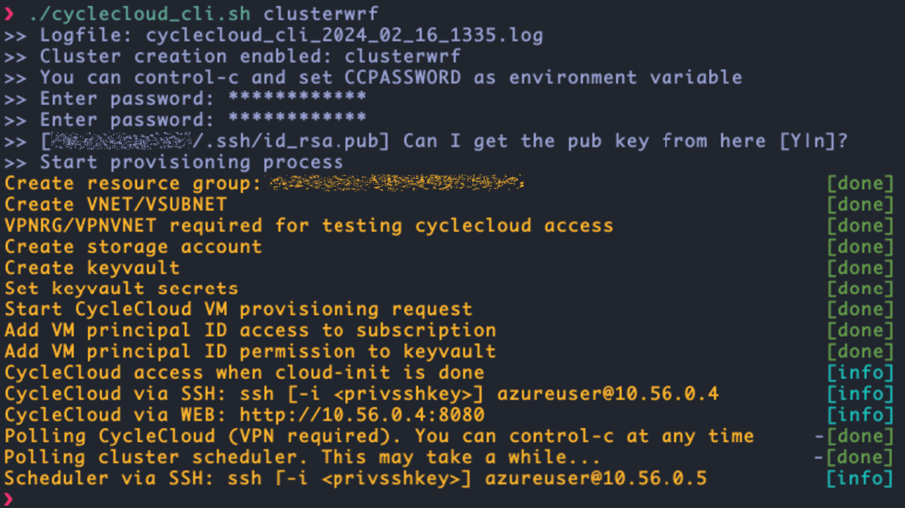
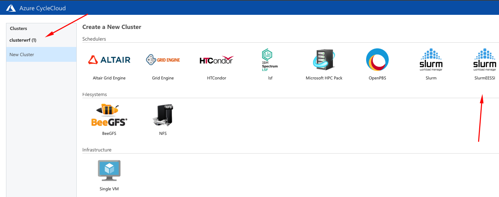

## Quick HPC Cluster Creation with Apps using CycleCloud and EESSI: A WRF example

**GitHub Pages: [Here](https://marconetto.github.io/azadventures/chapter12/)**

Would you like to have a single script to quickly provision High Performance
Computing (HPC) clusters with access to several ready-to-use HPC applications
(WRF, GROMACS, OpenFOAM, and many more) so you can focus on solving hard
scientific and engineering challenges? Then this blog may be relevant to you.


To achieve this goal we rely on a cluster provisioning solution described in
a previous blog post (see
[here](https://techcommunity.microsoft.com/t5/azure-high-performance-computing/automated-deployment-of-cyclecloud-and-slurm-using-cli/ba-p/3943666)),
which is based on Command Line Interface (CLI) from both Azure and Azure
CycleCloud. We then extended this script to automatically setup EESSI (European
Environment for Scientific Software Installations)---see a previous blog post on
EESSI
[here](https://techcommunity.microsoft.com/t5/azure-compute-blog/accessing-the-eessi-common-stack-of-scientific-software-using/ba-p/3688602).
And to make things concrete, we describe here how we put all of this together
using WRF (Weather Research & Forecasting) Model as a use case scenario.

## TL;TR

- We provide a script for a SLURM cluster creation via Azure CycleCloud ready to submit your (MPI) jobs using only Command Line Interface (CLI);
- We leverage EESSI to have access to ready-to-use applications which are mounted into the cluster nodes;
- The setup of EESSI is done via two relevant CycleCloud concepts: projects and cluster templates---so here you will learn a bit about those;
- We use WRF as example, so the cluster provisioned will contain both WRF application and the benchmarking data Conus 2.5km and Conus 12km automatically available for job submission;
- This tutorial shows how you could do this for different applications and is not intended to describe the optimized ways to run WRF in a production system. For this, there are plenty of material out there, including a previous blog post (see [here](https://techcommunity.microsoft.com/t5/azure-high-performance-computing/run-wrf-v4-on-azure-hpc-virtual-machines/ba-p/1131097) and [here](https://techcommunity.microsoft.com/t5/azure-high-performance-computing/tool-to-assist-in-optimal-pinning-of-processes-threads-for-azure/ba-p/2672201)).


Here is the git repository that contains the script:

- [git folder](https://github.com/marconetto/azadventures/tree/main/chapter12): git folder with automation script and cluster templates + cyclecloud projects for EESSI support
- [cyclecloud_cli.sh](cyclecloud_cli.sh): script itself to automate CycleCloud+SLURM installation using Azure/CycleCloud CLI
- [setvars.sh](setvars.sh): helper script to setup variables to customize deployment


## Assumptions

- Deployment relies only on PRIVATE IP addresses;
- Private and public ssh keys available;
- We use Ubuntu for all resources: CycleCloud VM, scheduler and cluster nodes.
- Azure CLI must be setup in the user machine that triggers the script call (i.e. `az login` should work with the subscription for deployment).

## 1. How to run the script

Customize variables in `setvars.sh`, including resource group, storage account,
keyvault, among others and `source` the file:

```
source setvars.sh
```

`CCPASSWORD` and `CCPUBKEY` are setup outside `setvars.sh`. When running the
automation script, you will be asked for their values in case you
haven't done before using:

```
export CCPASSWORD=<mygreatpassword>
export CCPUBKEY=$(cat ~/.ssh/id_rsa.pub)
```

If the variables below are setup, the script will automatically check for you
when the cluster is ready for job submission. Otherwise, you can check the
cluster creation yourself using Azure Bastion---the automation script will show
you the IP address of the CycleCloud VM.

```
export VPNRG=myvpnrg
export VPNVNET=myvpnvnet
```

Provision the resources (resources group, vnet, keyvault, cyclecloud, etc...):

```
./cyclecloud_cli.sh <clustername>
```

<p align="center" width="100%">
   
</p>

<p align="center" width="100%">
   
</p>


## 2. Run your WRF job


Once you are in the cluster scheduler via ssh or Azure Bastion, just:

```
sbatch -N 4 run_wrf_hb_2_5km.sh
```

SCREENSHOT OF ls + sbatch run_wrf.sh

The benchmark data is in the azureuser home directory, together with a couple of
SLURM batch script examples that you can work with depending on the SKU,
network, and data you want to use.

Here is an example of a sbatch script available to run using for instance HB
SKU, with Infiniband network, and Conus 2.5km benchmark data:

```
#!/bin/bash

export EESSI_SOFTWARE_SUBDIR_OVERRIDE=x86_64/amd/zen3

source /cvmfs/pilot.eessi-hpc.org/latest/init/bash
module load WRF/3.9.1.1-foss-2020a-dmpar
module load mpi

execdir="run_$((RANDOM % 90000 + 10000))"
mkdir -p $execdir
cd $execdir || exit
echo "Execution directory: $execdir"

wrfrundir=$(which wrf.exe | sed 's/\/main\/wrf.exe/\/run\//')
ln -s "$wrfrundir"/* .
ln -sf /shared/home/azureuser/bench_2.5km/* .

export UCX_NET_DEVICES=mlx5_ib0:1
export OMPI_MCA_pml=ucx

time mpirun -np 4 wrf.exe
```

Here we source the pilot EESSI repository which contains a WRF3.9 available. For
other applications you could explore the most up-to-date repository. See this
link for details:
[LINK](https://www.eessi.io/docs/repositories/software.eessi.io/)
Once you `source` the EESSI bash script, you can have access to many other apps,
including GROMACS, OpenFOAM, OpenBLAS, among others.


Now let's move to the behind the scenes here in case you want to learn how this
was done or you want to modify/expand the current automation.

EESSI will provide you with quick access to various applications.
Alternatively, you could modify the steps below, to have applications being
built from source code, or use frameworks such as SPACK or EasyBuild (see
references for details).


## 3. Behind the scenes: CycleCloud cluster templates, projects, cloud-init

When we provision a CycleCloud cluster, we can choose which job scheduler the
cluster resources are managed by; which includes SLURM, PBS, and LSF. Such
clusters have a pre-defined list of job queues. If we want to provision
a cluster with some customizations, such as pre-download an application, change
job queues and resource types, add start up tasks, among others, we can explore
what is called *cluster templates*, *projects*, and *cloud-init*.

#### Cluster templates

Cluster templates define cluster configurations. You can specify the VM types of
cluster nodes, storage options, deployment region, network ports to access
a scheduler node, cluster partitions/queues, etc. All these can also be
parameterized, so a template can be used for multiple use cases.

The format of these cluster templates follow the INI format. Further details can be
found in both links below:

```
[cluster]
  [[node, nodearray]]
    [[[volume]]]
    [[[network-interface]]]
    [[[cluster-init]]]
    [[[input-endpoint]]]
    [[[configuration]]]
[environment]
[noderef]
[parameters]
  [[parameters]]
    [[[parameter]]]
```


1. cyclecloud cluster templates [LINK 1](https://learn.microsoft.com/en-us/training/modules/customize-clusters-azure-cyclecloud/2-describe-templates)
1. cyclecloud cluster templates [LINK 2](https://learn.microsoft.com/en-us/azure/cyclecloud/how-to/cluster-templates?view=cyclecloud-8)

Here is an example of a cluster template for a SLURM cluster: [LINK](https://github.com/Azure/cyclecloud-slurm/blob/master/templates/slurm.txt)

#### Cluster projects

As mentioned above, cluster template defines configuration for the *overall*
cluster. Inside the template, you can define configurations for *nodes*, and
those are called CycleCloud *projects*. These projects contain *specs.* When
a node starts, CycleCloud configures it by processing and running a sequence of
specs. These specs can be python, shell, or powershell scripts. They are
executed once nodes are ready (different from cloud-init, which is executed
before cyclecloud processes are executed on the node).

Projects are used in the cluster templates with this following syntax:

```
[[[cluster-init <project>:<spec>:<project version>]]]
```

Here is a simplified view of a CycleCloud project:

```
\myproject
          ├── project.ini
          ├── templates
          ├── specs
          │   ├── default
          │     └── cluster-init
          │        ├── scripts
          │        ├── files
          │        └── tests
```

- **templates directory:** hold cluster templates
- **specs:** the specifications defining your project
- **scripts:** scripts executed in lexicographical order on the node
- **files:** raw data files to will be put on the node)
- **tests:** tests executed when a cluster is started in testing mode.

Here is the URL on how to create a project and additional functionalities of
cluster projects:
[LINK](https://learn.microsoft.com/en-us/azure/cyclecloud/how-to/projects?view=cyclecloud-8)


#### Cloud-init

CycleCloud also supports cloud-init. The configurations can be executed at the
first boot a VM performs, before any other CycleCloud specific configuration
occurs on the VM (such as installation of HPC schedulers). Cloud-init can be
used for configuring things such as networking, yum/apt mirrors, etc.

Further details can be found here: [LINK](https://learn.microsoft.com/en-us/azure/cyclecloud/how-to/cloud-init?view=cyclecloud-8)

```
[node scheduler]
CloudInit = '''#!/bin/bash
echo "cloud-init works" > /tmp/cloud-init.txt
'''
```

### Making WRF available on cluster nodes using EESSI


We can make WRF available through EESSI---European Environment for Scientific
Software Installations (EESSI, pronounced as "easy"). There are certain steps to
be executed in the cluster nodes to make WRF available for execution. We will
make use of cluster template and cyclecloud project files to get there.

All of the steps below have been added to the CycleCloud CLI automation script.

There are several ways of doing so; let's see one of those ways exploring
CycleCloud projects (we could alternatively use cloud-init).


#### Creating and uploading a CycleCloud project

```
LOCKER=`cyclecloud locker list | cut -d " " -f1`
echo $LOCKER | cyclecloud project init cc_eessi
```

Copy the new template to the user home directory:

```
cp $NEW_TEMPLATE $HOME/
```

Create a file with this content `cc_eessi/specs/default/cluster-init/scripts/00_setup_eessi.sh`:

```
#!/usr/bin/env bash

# instructions from: https://www.eessi.io/docs/getting_access/native_installation
sudo apt-get install lsb-release
wget https://ecsft.cern.ch/dist/cvmfs/cvmfs-release/cvmfs-release-latest_all.deb
sudo dpkg -i cvmfs-release-latest_all.deb
rm -f cvmfs-release-latest_all.deb
sudo apt-get update
sudo apt-get install -y cvmfs

wget https://github.com/EESSI/filesystem-layer/releases/download/latest/cvmfs-config-eessi_latest_all.deb
sudo dpkg -i cvmfs-config-eessi_latest_all.deb

sudo bash -c "echo 'CVMFS_CLIENT_PROFILE="single"' > /etc/cvmfs/default.local"
sudo bash -c "echo 'CVMFS_QUOTA_LIMIT=10000' >> /etc/cvmfs/default.local"

sudo cvmfs_config setup
```

Upload the project (in case you want to test it on existing CycleCloud
environment):

```
cd cc_eessi/
cyclecloud project upload $LOCKER
cd ..
```

Let's create a second project so the scheduler downloads the WRF benchmark data
once the scheduler is provisioned.


```
echo $LOCKER | cyclecloud project init cc_wrfconus
```

Create a file with this content `cc_wrfconus/specs/default/cluster-init/scripts/00_get_conus.sh`:


```
#!/usr/bin/env bash

ADMINUSER=$(grep name /opt/cycle/jetpack/config/auth.json | awk -F'"' '{print $4}')

runuser -l "$ADMINUSER" -c 'curl -O https://www2.mmm.ucar.edu/wrf/users/benchmark/v3911/bench_12km.tar.bz2'
runuser -l "$ADMINUSER" -c 'tar jxvf bench_12km.tar.bz2'

runuser -l "$ADMINUSER" -c 'curl -O https://www2.mmm.ucar.edu/wrf/users/benchmark/v3911/bench_2.5km.tar.bz2'
runuser -l "$ADMINUSER" -c 'tar jxvf bench_2.5km.tar.bz2'

```

Upload this second project (again, in case you want to test it on existing
CycleCloud environment):

```
cd cc_wrfconus/
cyclecloud project upload $LOCKER
cd ..
```


#### Getting the original SLURM template

Now we need a way to use these CycleCloud projects, and we will do this by
customizing a CycleCloud cluster template.

In your `$HOME` directory inside the CycleCloud VM:

```
EXISTING_TEMPLATE=$(sudo find /opt/cycle_server -iname "*slurm_template*txt")
NEW_TEMPLATE=newslurm.txt
sudo cp $EXISTING_TEMPLATE $NEW_TEMPLATE
sudo chown azureuser.azureuser $NEW_TEMPLATE
```

You can also get the template from git:

```
cyclecloud project fetch https://github.com/Azure/cyclecloud-slurm/releases/3.0.5 cc-slurm
NEW_TEMPLATE=cc-slurm/templates/slurm.txt
```

Or:

```
wget https://raw.githubusercontent.com/Azure/cyclecloud-slurm/3.0.5/templates/slurm.txt
```

If you `diff` these `NEW_TEMPLATE` files, the content should be exactly the same,
assuming you got the right release ID from your current CycleCloud installation.


#### Updating and uploading a CycleCloud cluster template

We modified $NEW_TEMPLATE in three places:

We first changed the cluster template name from `Slurm` to `SlurmEESSI`:

```
⋮
[cluster SlurmEESSI]
IconUrl = static/cloud/cluster/ui/ClusterIcon/slurm.png
FormLayout = selectionpanel
⋮
```

Second, we made sure EESSI could be used in all nodes, including the scheduler:

```
⋮
    [[node defaults]]
    UsePublicNetwork = $UsePublicNetwork
    Credentials = $Credentials
    SubnetId = $SubnetId
    Region = $Region
    KeyPairLocation = ~/.ssh/cyclecloud.pem
    Azure.Identities = $ManagedIdentity
    [[[cluster-init cc_eessi:default:1.0.0]]]
⋮
```

Third we added the WRF benchmark data project to be executed in the scheduler
node:

```
⋮
    [[node scheduler]]
    MachineType = $SchedulerMachineType
    ImageName = $SchedulerImageName
    IsReturnProxy = $ReturnProxy
⋮
        [[[cluster-init cyclecloud/slurm:scheduler:3.0.5]]]
        [[[cluster-init cc_wrfconus:default:1.0.0]]]
⋮
```

Upload the cluster template.


```
cyclecloud import_template -f $NEW_TEMPLATE
```

With this you are ready to play with the new
template+projects on existing CycleCloud. In our case, we uploaded these files
into get to be consumed by the automation script.


<br>

## References
1. azure cyclecloud:<br> <https://learn.microsoft.com/en-us/azure/cyclecloud/overview>
1. cyclecloud cluster templates (link 1):<br> <https://learn.microsoft.com/en-us/training/modules/customize-clusters-azure-cyclecloud/2-describe-templates>
1. cyclecloud cluster templates (link 2):<br> <https://learn.microsoft.com/en-us/azure/cyclecloud/how-to/cluster-templates?view=cyclecloud-8>
1. cyclecloud projects: <br>
   <https://learn.microsoft.com/en-us/azure/cyclecloud/how-to/projects?view=cyclecloud-8>
1. cyclecloud projects: <br> <https://learn.microsoft.com/en-us/training/modules/customize-clusters-azure-cyclecloud/5-customize-software-installations>
1. cyclecloud core concepts: <br>
   <https://learn.microsoft.com/en-us/azure/cyclecloud/concepts/core?view=cyclecloud-8>
1. SLURM cluster template: <br>
   <https://github.com/Azure/cyclecloud-slurm/blob/master/templates/slurm.txt>
1. cyclecloud cloud-init: <br> <https://learn.microsoft.com/en-us/azure/cyclecloud/how-to/cloud-init?view=cyclecloud-8>
1. EESSI:<br> <https://www.eessi.io/docs/getting_access/native_installation/>
1. EESSI+WRF on Azure: <br> <https://easybuild.io/eum22/013_eum22_WRF_Azure_EESSI.pdf>
1. SPACK: <br> <https://spack.io/>
1. EasyBuild: <br> <https://easybuild.io/>
