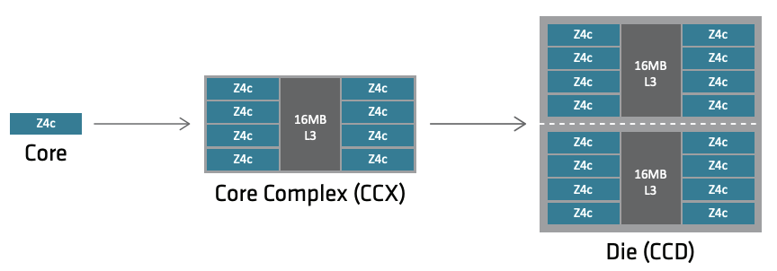
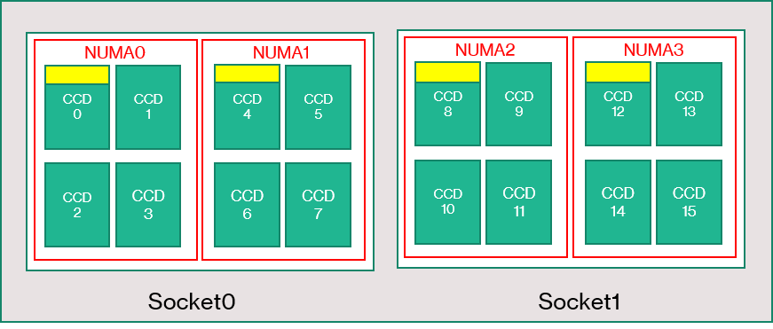
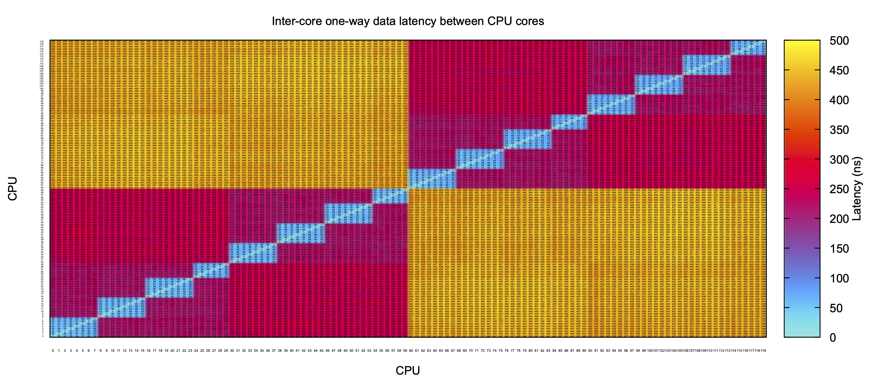
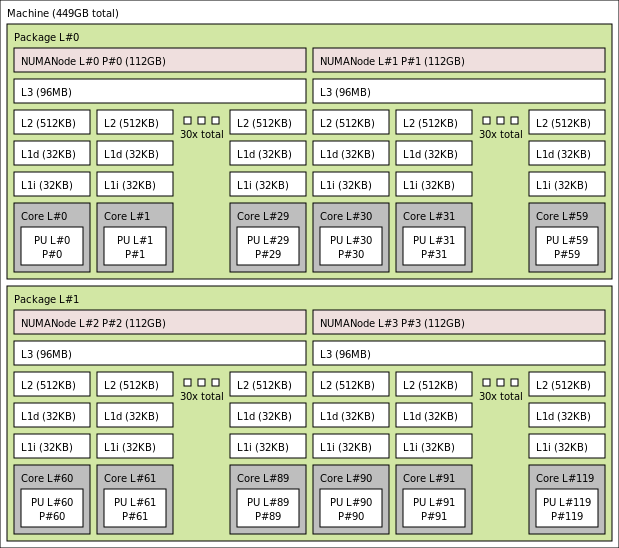

### Process/thread pinning (WIP)


#### Overview

In modern machines, memory access between processor core to the main memory is
not uniform. The machine memory is in separate regions called "NUMA domains".
Therefore, for optimal performance, cores should prioritize access to memory
that is in its nearest NUMA domain.

Process/thread pinning, also called CPU affinity, refers to binding or "pinning"
specific workload processes or threads to specific CPU cores. The goal is to
optimize performance by improving cache utilization, using resources evenly, and
ensuring consistent execution times. On Non-Uniform Memory Access (NUMA)
architectures, pinning processes/threads to specific cores can help ensure that
memory accesses are local to the processor, reducing latency. It also helps on
maximizing the use of L3 cache.

MPI (Message Passing Interface) implementations include support for process
affinity. For instance, OpenMPI, IntelMPI, HPC-x, and MPICH allow users to
specify CPU binding policies through environment variables or command-line
options. SLURM and PBS also allow such specification when starting user jobs.

In hybrid parallel applications, that is, those mixing distributed and shared
memory (e.g. OpenMPI and MPI), each process has multiple threads so, handling
the mapping of threads to leverage the same L3 cache is beneficial.

---

#### A bit on OpenMPI pinning flags

Depending on the MPI implementation, for instance OpenMPI, there are flags to
specify how the pinning should take place.

[Here](https://www-lb.open-mpi.org/papers/sc-2016/Open-MPI-SC16-BOF.pdf), on
page 84 onwards, you will find examples for OpenMPI `--map-by`, `--rank-by` and
`--bind-to`. This following reference also has an interesting description about
this topic:
[[LINK]](https://github.com/open-mpi/ompi/wiki/ProcessPlacement).

Terminology:

**NUMA node or NUMA domain**
- group of one or more CPUs (or cores) and the memory that is local to those CPUs.

**Socket**
-  the physical connector on the motherboard that holds the CPU, which may
contain multiple CPU cores and multiple NUMA nodes.

**Core Chiplet Die (CCDs)**
- physical groupings of CPU cores within a single piece of silicon, commonly
found in modern AMD processors.

**Core CompleX (CCX)**
- basic unit of the processor, i.e., group of CPU cores sharing resources like
L3 cache and memory controllers within a Core Complex (CCD).

**Slots**
- How many processes allowed on a node
- Oversubscribe: #processes > #slots

**Processing element (“PE”)**
- Smallest atomistic processor
- Frequently core or HT
- Overload: more than one process bound to PE

**Mapping**
- Assign each process to a location
- Determines which processes run on what nodes
- Detects oversubscription

**Ranking**
- Assigns MPI_COMM_WORLD rank to each process

**Binding**
- Constrain a process to execute on specific resources on a node.
- Processes can be bound to any resource on a node, including NUMA regions, sockets, and caches.
- Binds processes to specific processing elements
- Detects overload


The following document contains an overview of the relationship between CCD and
CCX (*4TH GEN AMD EPYC™ PROCESSOR ARCHITECTURE*):

<p align="center" width="100%">  </p>

<https://www.amd.com/system/files/documents/4th-gen-epyc-processor-architecture-white-paper.pdf>


In OpenMPI:

`--map-by`: Specifies the policy for mapping processes to hardware resources.
- `slot`: Use Open MPI’s default mapping.
- `node`: Map processes by node.
- `socket`: Map processes by socket.
- `core`: Map processes by core.
- `numa`: Map processes by NUMA node.

Example: `mpirun --map-by socket ./your_program`

`--bind-to`: Specifies the policy for binding processes to CPUs.
- `none`: No binding.
- `core`: Bind to individual cores.
- `socket`: Bind to sockets.
- `numa`: Bind to NUMA nodes.
- `board`: Bind to entire boards.

Example: `mpirun --bind-to core ./your_program`

`--report-bindings`: Reports the binding of processes after execution.

In summary, `--map-by` controls where processes are initially placed (i.e.
assign processes a hardware component), whereas
`--bind-to` to control how processes are pinned to specific hardware resources
once placed (i.e. restrict the motion of processes in the mapped hardware).

---

#### Check compute node information

This tool shows NUMA-related info of a machine and controls NUMA policy. Using
this flag you can observe output of NUMA info.

```
numactl --hardware
```

Here is an example of output for [Azure
HBv3](https://learn.microsoft.com/en-us/azure/virtual-machines/hbv3-series-overview)
machine (which contains 2 sockets and each socket contains 4 NUMA nodes):


<p align="center" width="100%">  </p>


```
$ numactl -H
available: 4 nodes (0-3)
node 0 cpus: 0 1 2 3 4 5 6 7 8 9 10 11 12 13 14 15 16 17 18 19 20 21 22 23 24 25 26 27 28 29
node 0 size: 114839 MB
node 0 free: 113693 MB
node 1 cpus: 30 31 32 33 34 35 36 37 38 39 40 41 42 43 44 45 46 47 48 49 50 51 52 53 54 55 56 57 58 59
node 1 size: 114905 MB
node 1 free: 113538 MB
node 2 cpus: 60 61 62 63 64 65 66 67 68 69 70 71 72 73 74 75 76 77 78 79 80 81 82 83 84 85 86 87 88 89
node 2 size: 114863 MB
node 2 free: 112997 MB
node 3 cpus: 90 91 92 93 94 95 96 97 98 99 100 101 102 103 104 105 106 107 108 109 110 111 112 113 114 115 116 117 118 119
node 3 size: 114904 MB
node 3 free: 112898 MB
node distances:
node   0   1   2   3
  0:  10  12  32  32
  1:  12  10  32  32
  2:  32  32  10  12
  3:  32  32  12  10
```

The memory latency distances between a node and itself is normalized to 10
(1.0x). So, the distance between NUMA Node 0 and 2 is 32 (3.2x).

The distances can also be obtained:

```
$ cat /sys/devices/system/node/node*/distance
```

If you want to obtain a measured distance for core-2-core, you can use this tool
below:

```
https://github.com/vgamayunov/c2clat
```

Here is an example of output (for HBv3). The figure was generated using
[gnuplot](http://www.gnuplot.info/)
but data from c2clat can be imported in excel for visualization too.

<p align="center" width="100%">  </p>


You can get the number of sockets:

```
$ lscpu | grep 'Socket(s):'
Socket(s):           2
```

You can see the socket id for each NUMA domain/node:

```
$ lscpu -e
CPU NODE SOCKET CORE L1d:L1i:L2:L3 ONLINE
0   0    0      0    0:0:0:0       yes
1   0    0      1    1:1:1:0       yes
2   0    0      2    2:2:2:0       yes
3   0    0      3    3:3:3:0       yes
...
```


You can also use `hwloc-ls` and `lstopo`, which provide text and graphical
representation of the machine topology, NUMA nodes, cache info, and processor
mapping. You can also get some processor info using `cat /proc/cpuinfo`.

Example of output for `lstopo` (for an HBv3 machine):

<p align="center" width="100%">  </p>


The tool `lstopo` come from `hwloc` package. The output can be text only or you
can generate an image. For the image support, you may need to install
`hwloc-gui` package. Then run:

```
lstopo --output-format png --no-legend  --no-io output.png
```

---

#### Pinning on Azure HPC VMs

The following blog describes the Azure HB Virtual Machine (VM) series and the
importance of properly mapping processes/thread to the multiple cores of the VM
processor. The blog post also provides an overview on taking care about process
placement when undersubscribing a VM (i.e. using fewer cores than they have).
For instance, HBv3 has 120 AMD cores; so if one desires to use 16 cores, Azure
offers a constrained HB120-16rs_v3, or the user can take care of the process
placement with the instructions from the blog.

- [Blog: Optimal MPI Process Placement for Azure HB Series
VMs](https://techcommunity.microsoft.com/t5/azure-high-performance-computing/optimal-mpi-process-placement-for-azure-hb-series-vms/ba-p/2450663)


There is another blog, which describes a python tool to assist on process
pinning for Azure HPC SKUs:

- [Blog: Tool to assist in optimal pinning of processes/threads for Azure HPC/AI VM’s](https://techcommunity.microsoft.com/t5/azure-high-performance-computing/tool-to-assist-in-optimal-pinning-of-processes-threads-for-azure/ba-p/2672201)


---

### References

- [HPCWiki - Binding/Pinning](https://hpc-wiki.info/hpc/Binding/Pinning)
- [blog: Optimal MPI Process Placement for Azure HB Series VMs](https://techcommunity.microsoft.com/t5/azure-high-performance-computing/optimal-mpi-process-placement-for-azure-hb-series-vms/ba-p/2450663)
- [blog: Tool to assist in optimal pinning of processes/threads for Azure HPC/AI VM’s](https://techcommunity.microsoft.com/t5/azure-high-performance-computing/tool-to-assist-in-optimal-pinning-of-processes-threads-for-azure/ba-p/2672201)
- [CPU pinning script 1](https://github.com/arstgr/woc-benchmarking/blob/main/apps/hpc/utils/azure_process_pinning.sh)
- [CPU pinning script 2](https://github.com/Azure/azurehpc/tree/master/experimental/check_app_pinning_tool)
- [CPU pinning script 3](https://github.com/wolfgang-desalvador/Azure-AMD-EPYC-pinning)
- [examples on OpenMPI --map-by, --rank-by and --bind-to (page 84 onwards)](https://www-lb.open-mpi.org/papers/sc-2016/Open-MPI-SC16-BOF.pdf)
- [OpenMPI docs](https://www.open-mpi.org/doc/current/man1/mpirun.1.php)
- [CW2020 S4V1 - Process and Thread Affinity with MPI/OpenMP - Yun He](https://www.youtube.com/watch?v=rImDMLMg3W8)
- [4TH GEN AMD EPYC™ PROCESSOR ARCHITECTURE](https://www.amd.com/system/files/documents/4th-gen-epyc-processor-architecture-white-paper.pdf)
- [c2clat tool - core to core latency](https://github.com/vgamayunov/c2clat)
- [lstopo tool (from hwloc)](https://github.com/open-mpi/hwloc)
- [discussion on docs about OpenMPI mapped-by,rank-by, and bind-to](https://github.com/open-mpi/ompi/issues/7042)
- [OpenMPI Wiki - Process Placement](https://github.com/open-mpi/ompi/wiki/ProcessPlacement)
- [Binding/Mapping/Ranking Page 66](https://agenda.infn.it/event/31877/contributions/181482/attachments/97828/135121/Introduction_to_MPI_esc22_07102022.pdf)
- [PETSc discussion on mpi process mapping](https://petsc.org/main/manual/performance/)
- [blog: Performance & Scalability of HBv4 and HX-Series VMs with Genoa-X CPUs (Jun 2023)](https://techcommunity.microsoft.com/t5/azure-high-performance-computing/performance-amp-scalability-of-hbv4-and-hx-series-vms-with-genoa/ba-p/3846766)
- [blog: Performance of Azure HBv4 and HX VMs for HPC (Nov 2022)](https://techcommunity.microsoft.com/t5/azure-high-performance-computing/performance-of-azure-hbv4-and-hx-vms-for-hpc/ba-p/3673730)


