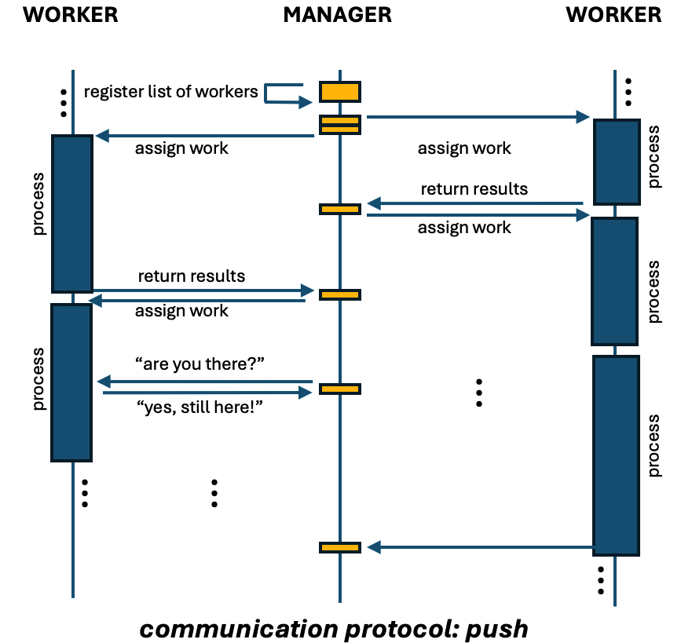
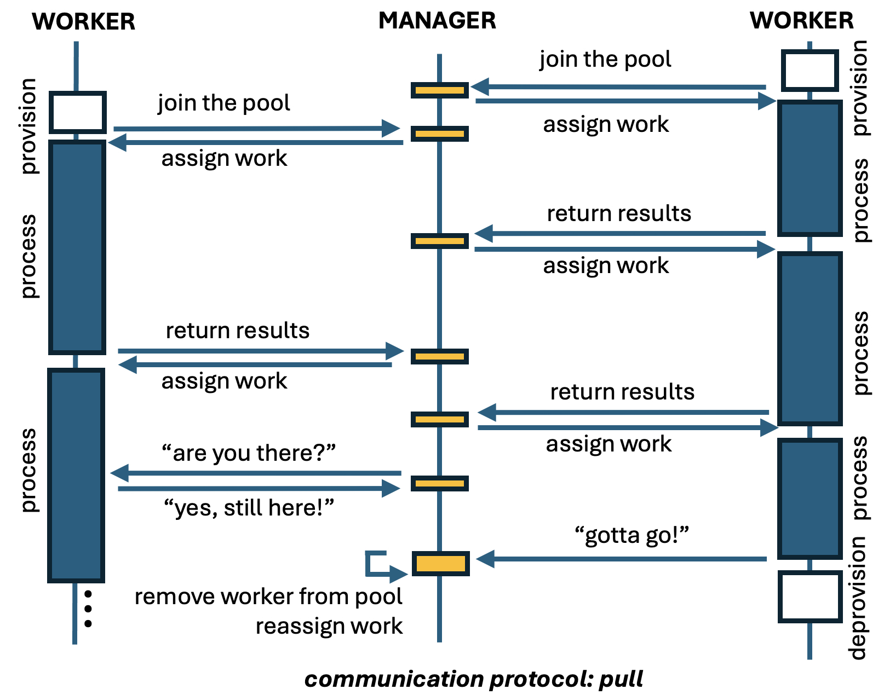

## Starting HPC Worker Processes at Boot Time in VM Scale Sets


The goal of this tutorial is to discuss places to start worker processes at boot
time when running embarrassingly parallel applications in Azure VM Scale Sets
(VMSSs). This tutorial is based on UbuntuLTS Linux operating system but can be
leveraged by users of other operating systems.


Embarrassingly parallel applications (a.k.a intrinsically parallel,  pleasingly
parallel, bag-of-tasks, etc) are those composed of tasks that can run
independently, that is, require no inter-task communication. They are in several
domains including financial risk modeling, VFX and 3D image processing, genetic
sequence analysis, monte carlo simulations, and software testing.


Let's first understand a bit about the communication protocol in these
applications, then have an overview about the provisioning/booting process of
a VM in Azure, and describe a few options available to start worker processes of
these applications at boot time. Even though the focus is on embarrassingly
parallel applications, other applications could benefit from this tutorial.


Coming from the on-premise world, a common practice is start worker processes
in systemd (or our old friend rc.local from System V Init). But is this the
right place to trigger worker processes in the cloud? Let's have a look!


#### TL;TR
- systemd and cloud-init are steps in boot executed while machine is still in
  **Creating** state;
- controls should be added to use sytemd and cloud-init to trigger worker
  process to guarantee the VM instance has reached **Succeeded** state;
- azure extension is executed just before the machine reached the **Succeeded**
  state, but it is executed only when the machine is provisioned---so it won't
  be executed if the VM instance needs to rebooted.

#### 1. Communication protocol in embarrassingly parallel applications


The architecture of embarrassingly parallel applications usually consists of
a manager, which contains tasks that need to be executed, have been executed, or
failed. This manager assign the tasks to workers, which are responsible for the
execution of the pending tasks. This manager-worker architecture has other names
in literature, but the concept is the same.


There are two major communication protocols for these application. One is called
**Push**, in which the manager is knows a priori all the workers available in
a worker pool and assigns tasks to the workers as the tasks become completed.
So, the load distribution is initiated by the manager.




Another one is called
**Pull**, in which the manager waits for workers to be part of the
worker pull and to request work to the manager. Therefore, the major different
between these protocols lies on the initialization. During the life time of the
worker process, there can be some health check messages in order verify if
workers are still processing and are alive.



When using VMSS, it is common to explore auto-scaling capabilities, in which
the number of VMs changes overtime. When workers have to let the manager know
that they are available to be part of the worker pool and receive work, there
are a few options to start the worker process. But before getting into that,
let's first take a look at the provisioning and boot process of VMs.

#### 2. Provisioning + boot process


Many steps are executed from the moment a request is made to create a VM
instance until it is fully available to the user. Physical resources have to be
identified, network and storage infrastructure has to be in place, operating
system image has to retrieved and installed, monitoring and agents have to be
installed, operating system has to boot, post-booting processes have to be run,
health checks executed, etc..

Here are some relevant points to our context:

- The Guest Agent, also known as the Azure VM Agent, which runs within an Azure
  virtual machine (VM) is installed, usually, before the booting. It is
  responsible for the interaction of the VM with the Azure platform. It enables,
  for instance, the VM to send status updates, receive instructions, and report
      health information to the Azure platform. It also allows the installation
      and update of Azure VM extensions. and manages security-related tasks.

- Once the machine starts booting, several services start execution as part of
  the Linux **systemd** suite. And Secure Shell Service is one of them. So, one
  can ssh into the VM that is being provisioned while the provisioning state is
  still **Creating**.

- As part of the **systemd** suite, cloud-init is also triggered. It reads the
  configuration from the cloud-init user-data, metadata, or custom configuration
  file(s) and executes the defined actions including package installation,
  storage mount points, network configuration, and custom scripts. Again, here
  the machine is still in **Creating** state. Cloud-init creates a filed called
  ``/var/lib/cloud/instance/boot-finished`` once it finishes execution. This is
  not an indication the the machine reached the **Succeeded** state because
  azure still has to run internal processes before releasing the machine to the
  user.

- After the VM has reached the **Succeeded** state, the Azure VM Agent
  communicates with the Azure platform to fetch the required Azure VM
  Extensions. The Azure VM Agent then proceeds to install and execute the
  specified extensions on the VM.


#### 3. Where to trigger the worker process


##### 3.1 service unit in systemd


Depending on the application, its installer may create a new service unit file in
systemd to trigger the starting of a worker process at boot time. Something like
this:

```
[Unit]
Description=HPC application on image processing

[Service]
ExecStart=/usr/local/bin/myhpcworkerprocess

[Install]
WantedBy=multi-user.target
```

If this is the case, one must realize that at this moment the full provisioning
process is not yet completed and the status of the VM is still **Creating**.

This may not be a problem for some applications. However depending on the
application, the time to get to the **Succeeded** provisioning state, and other
factors including auto-scaling rules, placing the starting of the worker process
here may be a problem. For instance, the worker process may start receiving load
which will not be computed in auto-scaling rules because the machine has not
yet being fully provisioned. If the manager process of the user application
distributes load based on health check information of VMs running worker
processes, the manager process be get confused because the worker process is
running but it is not ready.

Placing the worker process here can also complicate debugging because there are
other processes under execution while the worker process is already running,
including cloud-init and other azure-related services.


Given this context, it is possible to include a simple polling mechanism on the
machine itself to start the worker process once the machine reaches
**Succeeded** state.


To test the current status of a machine, one can rely on (i) Azure Instance
Metadata Service (IMD) and Azure Managed Identity via Azure CLI. IMD provides
information about VMs. IMDS is a REST API available in this IP address:
169.254.169.254. Requests to this service can only be accessed from within the
VM. We are gonna use IMD to get the resource id in Azure from the VM. We will
use Azure CLI to obtain the provisioning status information. Azure CLI needs to
login into Azure, and we are gonna do this via Managed Identity so we can
automate this process.


First, we need to make sure VMSS has system identity enabled. So, from the
machine you provisioned your VMSS (e.g. your jumpbox machine), you can type
(replacing myresourcegroup, myscaleset, mysubscription accordingly):

```
az vmss identity assign --resource-group <myresourcegroup> \
                        --name <myscaleset> \
                        --role Reader \
                        --scope /subscriptions/<mysubscription>/resourceGroups/<myresourcegroup>
```

if you want to propagate to existing VM instances:

```
az vmss update-instances --resource-group <myresourcegroup>
                         --name myScaleSet --instance-ids '*'
```

If you want to have system identity at the VMSS creation time, as an example,
you can use the following command:


```
az vmss create --resource-group <myresourcegroup> \
               --name <myvmss> \
               --image UbuntuLTS \
               --upgrade-policy-mode automatic \
               --custom-data cloud-init.txt \
               --admin-username azureuser \
               --admin-password <myadminpassword> \
               --generate-ssh-keys \
               --assign-identity \
               --role reader \
               --scope <mysubscription>
```
The last three parameters are related to the managed identity, which enables
identity and assigns an Azure role of 'Reader' to 'mySubscrition':

With managed identity configured, you can use the following code to verify if
the VM has reached the **Succeeded** state at time intervals defined by the
``POOLINGTIME`` variable. This code is to be executed by the VMSS VM instance
itself.


```
#!/usr/bin/env bash

POOLINGTIME=10

if ! command -v az &> /dev/null
then
    echo "azure client not installed"
    curl -sL https://aka.ms/InstallAzureCLIDeb | sudo bash
fi

az login --identity

vm_resource_id=$(curl -H "Metadata: true" "http://169.254.169.254/metadata/instance/compute/resourceId?api-version=2021-02-01&format=text")

provisioningState="None"
while $provisioning_state != "Succeeded" ; then
    provisioning_state=$(az resource show --ids "$vm_resource_id" \
                                          --query 'properties.provisioningState'
                                          --output tsv)
    sleep $POOLINGTIME
done
```

You can encapsulate the above code snippet into a script, for instance, located
in ``/usr/local/bin/waitprovisioning.sh`` and add execution permission:

```
chmod +x /usr/local/bin/waitprovisioning.sh
```

This script can then be called before the execution of the worker process in
original systemd service unit file triggering the worker process:

```
[Unit]
Description=HPC application on image processing

[Service]
ExecStart=/bin/bash -c '/usr/local/bin/waitprovisioning.sh && /usr/local/bin/myhpcworkerprocess'

[Install]
WantedBy=multi-user.target
```

Alternatively one can use ``ExecStart`` with ``ExecStartPre``:

```
[Unit]
Description=HPC application on image processing

[Service]
ExecStartPre=/usr/local/bin/waitprovisioning.sh
ExecStart=/usr/local/bin/myhpcworkerprocess

[Install]
WantedBy=multi-user.target
```


##### 3.2 cloud init

Cloud-init is another place one may consider to start a worker process. However,
cloud-init is typically designed for initialization tasks during the instance
boot process and is not intended for continuous execution of long-running
processes such as an HPC worker process. It is also a place to add tasks to be
executed at the provisioning phase of the VM, and not tasks to be executed every
boot (different from systemd above)---but note you can configure it to do so.
Even though it is not a recommended place to add the trigger for an application
worker process, it is worth mentioning it.

At the stage of the cloud-init execution the VM is also not at the **Succeeded**
provisioning state. So if one has a code like the one below to trigger the
worker process, be aware it is still in **Creating** status:


```
#cloud-config

runcmd:
  - nohup /usr/local/bin/myhpcworkerprocess &
```

To force the waiting of the Succeeded state, the ``waitprovisioning.sh`` script
could be used here as well.

```
#cloud-config

runcmd:
  - nohup /bin/bash -c '/usr/local/bin/waitprovisioning.sh && /usr/local/bin/myhpcworkerprocess' &
```

In this examples, cloud-init will run every time the VM is provisioned and not
in every boot once it is provisioned.

If one wants to use cloud-init to add the trigger of the worker node in every
boot, add a script in ``/var/lib/cloud/scripts/per-boot`` that waits for the
provisoning state to get to **Succeeded** and triggers the worker process.
Scripts in this folder are executed in alphabetical order.


##### 3.3 Azure custom script extension

Last, but not least, we have the Azure custom script extension. You can use such
extension for post-deployment configuration, software installation, and other
configuration or management tasks. The custom script can be automatically
downloaded from from Azure Storage or another accessible internet location
including github, or some direct commands one can specify.

But note that the script is executed as the last step of the provisioning phase
(just before it reaches the **Succeeded** state) and if the machine is rebooted,
the script won't be executed again.

There are several ways to use the azure custom script, including Azure Portal
and ARM template. Here is one way to do it via Azure CLI.

What has to be done is to assign a custom script to an VMSS (by using ARM
templates one could assign the custom script together with the provisioning
step). Once the script has been assigned, it will affect the new VM instances
created. So it may be an option to create a VMSS with zero VM instances and then
assign the custom script.

```
 az vmss extension set --vmss-name <myscaleset> \
                       --resource-group <myresourcegroup> \
                       --name customScript \
                       --version 2.0 --publisher Microsoft.Azure.Extensions \
                       --settings '{"commandToExecute": ""nohup /usr/local/bin/myhpcworkerprocess &" "}'
```


#### 4. Key takeways

Here we saw some options to handle to triggering of worker processes at VM boot
time in VMSS.


If the worker application needs to be embedded into the VM image, it is worth
adding the ``waitprovisioning.sh`` snippet and worker process trigger in
a systemd service unit. The advantage is that whenever the VMs get rebooted, the
worker process will be triggered.

Some times one be install the worker application using Cloud-init. If that is
the case, the ``waitprovisioning.sh`` snippet could also be used in cloud-init,
with extra care to add the triggering of the worker process in the cloud-init
``per-boot`` folder in order to be executed even when the VM requires rebooting.

If one is sure that the VM instance won't require reboot, using Azure custom
script seems to be a clean solution because it is executed just before VMs get
into the **Succeeded** state.

Depending on the application, making sure the VMs reach the **Succeeded** state
before triggering the worker process is particularly important when VMSS has the
overprovisioning feature enabled, otherwise the manager process may assign work
to a VM that will be suddenly destroyed.


## References

- cloud init: https://cloudinit.readthedocs.io/en/latest/explanation/boot.html
- cloud init per-boot: https://cloudinit.readthedocs.io/en/20.4/topics/modules.html?highlight=per-boot#scripts-per-boot
- custom script: https://learn.microsoft.com/en-us/azure/virtual-machines/extensions/custom-script-linux

- systemd: https://www.freedesktop.org/wiki/Software/systemd/
- VM metadata service: https://learn.microsoft.com/en-us/azure/virtual-machines/instance-metadata-service?tabs=linux
- managed identity: https://learn.microsoft.com/en-us/azure/active-directory/managed-identities-azure-resources/overview
- managed identity: https://learn.microsoft.com/en-us/azure/active-directory/managed-identities-azure-resources/qs-configure-cli-windows-vmss
- azure cli:
  https://learn.microsoft.com/en-us/cli/azure/install-azure-cli-linux?pivots=apt
- custom extension for
  vmss: https://learn.microsoft.com/en-us/cli/azure/vmss/extension?view=azure-cli-latest
- custom extension: https://learn.microsoft.com/en-us/azure/virtual-machines/extensions/custom-script-linux
- overprovisioning feature: https://learn.microsoft.com/en-us/azure/virtual-machine-scale-sets/virtual-machine-scale-sets-design-overview#overprovisioning
