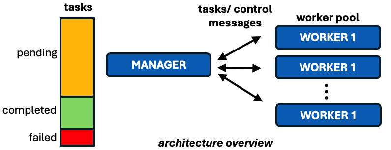
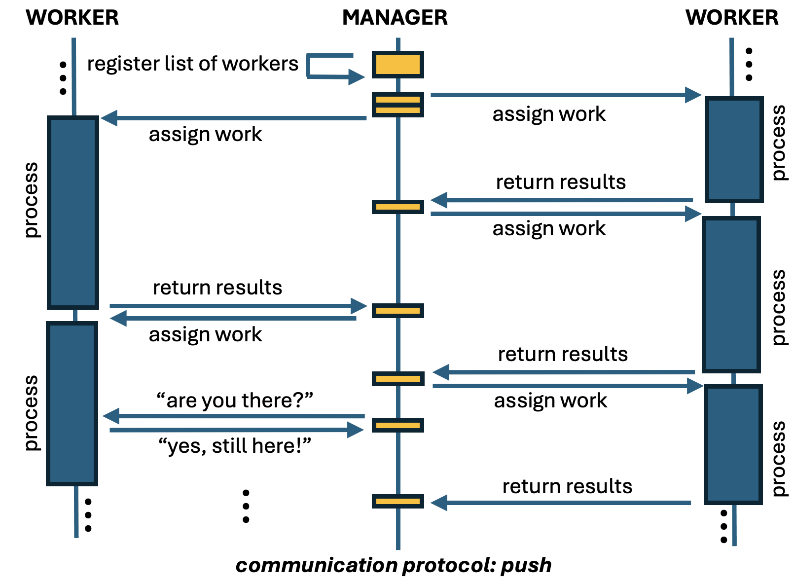

## Starting HPC Worker Processes at Boot Time in VM Scale Sets

One is deploying an HPC embarrassingly parallel application in Azure Virtual
Machine Scale Sets (VMSSs) and realized that (i) ssh into VM instances is
possible even when they have not been fully provisioned and (ii) worker
processes start before such provisioned state is reached. If you got into this
situation, this tutorial may be relevant to you.

The goal of this tutorial is to discuss places to start worker processes at boot
time when running embarrassingly parallel applications in Azure VMSSs. The
description here is based on UbuntuLTS Linux operating system but can be
leveraged by users of other operating systems. Users of other application types
may benefit from this tutorial as well.

Let's first understand a bit about the communication protocol in these
applications, then have an overview about the provisioning/booting process of
a VM in Azure, and describe a few options available to start worker processes of
these applications at boot time.

Coming from the on-premise world, a common practice is to trigger worker
processes in systemd (or in our old friend rc.local from System V Init). But is
this the right place to trigger worker processes in the cloud? Let's have
a look!


#### TL;TR
- The systemd and cloud-init systems are part of the boot process executed while
  a VM is still in **Creating** state;
- Controls should be added to use systemd and cloud-init to guarantee worker
  process is triggered after a VM reaches the **Succeeded** state (we've got
  a code snippet for that);
- Azure custom script extension is executed just before the provisioned VMs
  reach the **Succeeded** state. It sounds good but two things to consider: (i)
  it is executed only when VMs are provisioned (not called when they are just
  rebooted) and (ii) if VMSS **overprovisioning** feature is enabled, the
  exceeding VMs that are destroyed do execute the custom script---so worker
  processes will get started but their VMs will quickly become unavailable later
  on.

#### 1. Communication protocol in embarrassingly parallel applications

Embarrassingly parallel applications (a.k.a intrinsically parallel, pleasingly
parallel, bag-of-tasks, etc) are those composed of tasks that can run
independently, that is, require no inter-task communication. They are in several
domains including financial risk modeling, VFX and 3D image processing, genetic
sequence analysis, monte carlo simulations, and software testing.


The architecture of embarrassingly parallel applications usually consists of
a manager, which contains tasks that need to be executed, have been executed, or
failed. This manager assigns tasks to workers, which are responsible for their
execution. This manager-worker architecture has other names in literature, but
the components and concept are the same.


<p align="center" width="100%">
    
</p>


There are two major communication protocols in this type of application. One is
called **Push**, in which the manager knows a priori all the workers available
in the worker pool and assigns tasks to the workers as the tasks get completed.
So, the load distribution is initiated by the manager.


<p align="center" width="100%">
    
</p>


Another protocol is called
**Pull**, in which the manager waits for workers to be part of the
worker pool and to request work to the manager. Therefore, the major difference
between these protocols lies on the initialization. During the life time of the
worker process, there can be some health check messages in order verify if
workers are still processing and are alive.

<p align="center" width="100%">
    
</p>


When using VMSS, it is a common practice to explore its auto-scaling
capabilities to increase or reduce the number of VM instances. There are a few
options to let the manager know when workers want to join the worker pool. But
before getting into that, let's first take a look at the provisioning and boot
process of VMs.


#### 2. Provisioning + boot process


Many steps are executed from the moment a request is made to create a VM
instance until it is fully available to the user. Physical resources have to be
identified, network and storage infrastructure has to be in place, operating
system image has to retrieved and installed, monitoring and agents have to be
installed, operating system has to boot, post-booting processes have to be run,
health checks executed, etc.

Here are some relevant points to our context:

- The Guest Agent, also known as the Azure VM Agent, which runs within an Azure
  virtual machine (VM) is installed, usually, before the booting. It is
  responsible for the interaction of the VM with the Azure platform. It enables,
  for instance, the VM to send status updates, receive instructions, and report
      health information to the Azure platform. It also allows the installation
      and update of Azure VM extensions and performs security-related tasks;

- Once the machine starts booting, several services start execution as part of
  the Linux **systemd** suite. And Secure Shell Service is one of them. So, one
  can ssh into the VM that is being provisioned while the provisioning state is
  still **Creating**;

- As part of the **systemd** suite, **cloud-init** is also triggered. It reads the
  configuration from the cloud-init user-data, metadata, or custom configuration
  file(s) and executes the defined actions including package installation,
  storage mount points, network configuration, and custom scripts. Again, here
  the machine is still in **Creating** state. Cloud-init creates a filed called
  ``/var/lib/cloud/instance/boot-finished`` once it finishes execution. This is
  not an indication that the machine reached the **Succeeded** state because
  Azure still has to run internal processes before releasing the machine to the
  user;

- When the VM is about to reach the **Succeeded** state, the Azure VM Agent
  communicates with the Azure platform to fetch the required Azure VM
  Extensions. The Azure VM Agent then proceeds to install and execute the
  specified extensions on the VM.


#### 3. Where to trigger the worker process: service unit in systemd


Depending on the application, its installer may create a new service unit file
in systemd to trigger the starting of a worker process at boot time. Here we
assume that ``/usr/local/bin/myhpcworkerprocess`` is the command to start the
worker process and that it goes to background once the worker initializes (i.e.
does not get stuck in foreground). An example of a service unit file would be:

```
[Unit]
Description=HPC application on image processing

[Service]
ExecStart=/usr/local/bin/myhpcworkerprocess

[Install]
WantedBy=multi-user.target
```

If this is the case, one must realize that at this moment the full provisioning
process is not yet completed and the state of the VM is still **Creating**.

This may not be a problem for some applications. However, for others, depending
on the time to get to the **Succeeded** state, and other factors including
auto-scaling rules, triggering the worker process here may be a problem. For
instance, the worker may start processing load and the auto-scaling threshold
time has not started counting yet because the machine is not fully provisioned.
Another example of issue is if the manager uses health check information of VMs
running worker processes for load distribution purposes. In this case the
manager process may get confused because the worker process is running but the
VM is "not available".

Placing the worker process here can also complicate debugging because there are
other processes under execution while the worker process is already running,
including cloud-init and other azure-related services.


Given this context, it is possible to include a simple polling mechanism on the
machine itself to start the worker process once the machine reaches
**Succeeded** state.


To test the current status of a machine, one can rely on (i) Azure Instance
Metadata Service (IMD) and Azure Managed Identity via Azure CLI. IMD provides
information about VMs. IMDS is a REST API available in this IP address:
169.254.169.254. Requests to this service can only be accessed from within the
VM. We are gonna use IMD to get the resource id in Azure from the VM. We will
use Azure CLI to obtain the provisioning status information. Azure CLI needs to
login into Azure, and we are gonna do this via Managed Identity so we can
automate this process.


First, we need to make sure VMSS has system identity enabled. So, from the
machine you provisioned your VMSS (e.g. your jumpbox machine), you can type
(replacing myresourcegroup, myscaleset, mysubscription accordingly):

```
az vmss identity assign --resource-group <myresourcegroup> \
                        --name <myscaleset> \
                        --role Reader \
                        --scope /subscriptions/<mysubscription>/resourceGroups/<myresourcegroup>
```

If you want to propagate to existing VM instances:

```
az vmss update-instances --resource-group <myresourcegroup>
                         --name <myscaleset> --instance-ids '*'
```

If you want to have system identity at the VMSS creation time, as an example,
you can use the following command:


```
az vmss create --resource-group <myresourcegroup> \
               --name <myvmss> \
               --image UbuntuLTS \
               --upgrade-policy-mode automatic \
               --custom-data cloud-init.txt \
               --admin-username azureuser \
               --admin-password <myadminpassword> \
               --generate-ssh-keys \
               --assign-identity \
               --role reader \
               --scope <mysubscription>
```
The last three parameters are related to the managed identity, which enables
identity and assigns an Azure role of 'Reader' to 'mysubscription':

With managed identity configured, you can use the following code to verify if
the VM has reached the **Succeeded** state at time intervals defined by the
``POOLINGTIME`` variable. This code is to be executed by the VMSS VM instance
itself.


```
#!/usr/bin/env bash

# add here the functions install_azure_cli and retry_installer from the code snippet
# in the appendix of this tutorial to install azure cli

if ! command -v az &> /dev/null
then
    echo "azure client not installed"
    install_azure_cli
fi

POOLINGTIME=10

az login --identity

vm_resource_id=$(curl -H "Metadata: true" "http://169.254.169.254/metadata/instance/compute/resourceId?api-version=2021-02-01&format=text")

provisioningState="None"
while [ "$provisioning_state" != "Succeeded" ]; do
    provisioning_state=$(az resource show --ids "$vm_resource_id" \
                                          --query 'properties.provisioningState' \
                                          --output tsv)
    echo "provisioning state = $provisioning_state"
    sleep "$POOLINGTIME"
done

echo "ready to go!"
```

You can encapsulate the above code snippet into a script, for instance, located
in ``/usr/local/bin/waitprovisioning.sh`` and add execution permission:

```
chmod +x /usr/local/bin/waitprovisioning.sh
```

This script can then be called before the execution of the worker process in
the original systemd service unit file triggering the worker process:

```
[Unit]
Description=HPC application on image processing

[Service]
ExecStart=/bin/bash -c '/usr/local/bin/waitprovisioning.sh && /usr/local/bin/myhpcworkerprocess'

[Install]
WantedBy=multi-user.target
```

Alternatively one can use ``ExecStart`` with ``ExecStartPre``:

```
[Unit]
Description=HPC application on image processing

[Service]
ExecStartPre=/usr/local/bin/waitprovisioning.sh
ExecStart=/usr/local/bin/myhpcworkerprocess

[Install]
WantedBy=multi-user.target
```


#### 4. Where to trigger the worker process: cloud init

Cloud-init is another place one may consider to start a worker process. However,
cloud-init is typically designed for initialization tasks during the instance
first boot process and is not intended for continuous execution of long-running
processes such as an HPC worker process. It is also a place to add tasks to be
executed at the provisioning phase of the VM, and not tasks to be executed every
boot (different from systemd above)---but note you can configure it to do so.

At the stage of the cloud-init execution the VM is also not at the **Succeeded**
provisioning state. So if one has a code like the one below to trigger the
worker process, be aware it is still in **Creating** status:


```
#cloud-config

runcmd:
  - /usr/local/bin/myhpcworkerprocess
```

To force the waiting of the Succeeded state, the ``waitprovisioning.sh`` script
could be used here as well.

```
#cloud-config

runcmd:
  - /bin/bash -c '/usr/local/bin/waitprovisioning.sh && /usr/local/bin/myhpcworkerprocess'
```

In this example, cloud-init will run this code only once---when the VM is
provisioned and not in every boot once it is provisioned.

If one wants to use cloud-init to add the trigger of the worker node in every
boot, add a script in ``/var/lib/cloud/scripts/per-boot`` that waits for the
provisoning state to get to **Succeeded** and triggers the worker process.
Scripts in this folder are executed in alphabetical order. Make sure the script
has ``#!/bin/sh`` in its first line and proper executable permission such as
``chmod 744 script.sh``.


#### 5. Where to trigger the worker process: Azure custom script extension

Last, but not least, we have the Azure custom script extension. You can use such
extension for post-deployment configuration, software installation, and other
configuration or management tasks. The custom script can be automatically
downloaded from Azure Storage or another accessible Internet location
including github, or some direct commands one can specify.

But note that the script is executed as the last step of the provisioning phase
(just before it reaches the **Succeeded** state) and if the machine is rebooted,
the script won't be executed again.

There are several ways to use the azure custom script, including Azure Portal
and ARM template. Here is one way to do it via Azure CLI.

One must assign a custom script to a VMSS (by using ARM templates one could
assign the custom script together with the provisioning step). Once the script
has been assigned, it will affect the new VM instances created. So it may be an
option to create a VMSS with zero VM instances and then assign the custom
script.

```
 az vmss extension set --vmss-name <myscaleset> \
                       --resource-group <myresourcegroup> \
                       --name customScript \
                       --version 2.0 --publisher Microsoft.Azure.Extensions \
                       --settings '{"commandToExecute": "/usr/local/bin/myhpcworkerprocess"}'
```

**NOTE:** If the **overprovisioning** feature is enabled in the VMSS, the VMs
not utilized to meet user request also execute the script before they are
destroyed (i.e. move to **Deleting** state). So worker processes will be started
and VMs will get unavailable quickly later on. Therefore, if overprovisioning is
enabled, it is recommended to use the ``waitprovisioning.sh`` script as well.

#### 6. Key takeways

Here we discussed some options to handle the triggering of worker processes at VM boot
time in VMSS.


If the worker application needs to be embedded into the VM image, it is worth
adding the ``waitprovisioning.sh`` code snippet and worker process trigger in
a systemd service unit. The advantage is that whenever a VM instance gets
rebooted, the worker process gets triggered.

One may want to install the worker application using cloud-init. If that is the
case, the ``waitprovisioning.sh`` code snippet plus the triggering of the worker
process could be placed in cloud-init. However, the ``per-boot`` folder should
be used because scripts they are executed whenever a VM boots---typically
cloud-init is used to install/configure software only at the provisioning time.

If one is sure that the VM instances won't require reboot, using Azure custom
script is a good alternative because it is executed just before VMs get
into the **Succeeded** state. So there is no need to add a control to wait for
the **Succeeded** state, unless overprovisioning feature is enabled. This will
guarantee that the manager process will not assign work to a VM that will be
suddenly destroyed.


## References

- **azure cli:**
  [https://learn.microsoft.com/en-us/cli/azure/install-azure-cli-linux?pivots=apt](https://learn.microsoft.com/en-us/cli/azure/install-azure-cli-linux?pivots=apt)
- **cloud init:**
  [https://cloudinit.readthedocs.io/en/latest/explanation/boot.html](https://cloudinit.readthedocs.io/en/latest/explanation/boot.html])
- **cloud init per-boot:** [https://cloudinit.readthedocs.io/en/20.4/topics/modules.html?highlight=per-boot#scripts-per-boot](https://cloudinit.readthedocs.io/en/20.4/topics/modules.html?highlight=per-boot#scripts-per-boot)
- **custom extension:** [https://learn.microsoft.com/en-us/azure/virtual-machines/extensions/custom-script-linux](https://learn.microsoft.com/en-us/azure/virtual-machines/extensions/custom-script-linux)
- **custom extension for
  vmss:** [https://learn.microsoft.com/en-us/cli/azure/vmss/extension?view=azure-cli-latest](https://learn.microsoft.com/en-us/cli/azure/vmss/extension?view=azure-cli-latest)
- **custom script:** [https://learn.microsoft.com/en-us/azure/virtual-machines/extensions/custom-script-linux](https://learn.microsoft.com/en-us/azure/virtual-machines/extensions/custom-script-linux)
- **managed identity:** [https://learn.microsoft.com/en-us/azure/active-directory/managed-identities-azure-resources/overview](https://learn.microsoft.com/en-us/azure/active-directory/managed-identities-azure-resources/overview)
- **managed identity:** [https://learn.microsoft.com/en-us/azure/active-directory/managed-identities-azure-resources/qs-configure-cli-windows-vmss](https://learn.microsoft.com/en-us/azure/active-directory/managed-identities-azure-resources/qs-configure-cli-windows-vmss)
- **overprovisioning feature:** [https://learn.microsoft.com/en-us/azure/virtual-machine-scale-sets/virtual-machine-scale-sets-design-overview#overprovisioning](https://learn.microsoft.com/en-us/azure/virtual-machine-scale-sets/virtual-machine-scale-sets-design-overview#overprovisioning)
- **systemd:** [https://www.freedesktop.org/wiki/Software/systemd/](https://www.freedesktop.org/wiki/Software/systemd/)
- **VM metadata service:** [https://learn.microsoft.com/en-us/azure/virtual-machines/instance-metadata-service?tabs=linux](https://learn.microsoft.com/en-us/azure/virtual-machines/instance-metadata-service?tabs=linux)


## Appendix

Use the following code if Azure client is not in the VM image:

```
function retry_installer(){
    local attempts=0
    local max=15
    local delay=25

    while true; do
        ((attempts++))
        "$@" && {
            echo "CLI installed"
            break
        } || {
            if [[ $attempts -lt $max ]]; then
                echo "CLI installation failed. Attempt $attempts/$max."
                sleep $delay;
            else
                echo "CLI installation has failed after $attempts attempts."
                break
            fi
        }
    done
}

function install_azure_cli(){
    install_script="/tmp/azurecli_installer.sh"
    curl -sL https://aka.ms/InstallAzureCLIDeb -o "$install_script"
    retry_installer sudo bash "$install_script"
    rm $install_script
}

if ! command -v az &> /dev/null
then
    echo "azure client not installed"
    install_azure_cli
fi
```


Copy of the ``waitprovisioning.sh``: [waitprovisioning script](https://github.com/marconetto/azadventures/blob/main/chapter7/waitprovisioning.sh)
